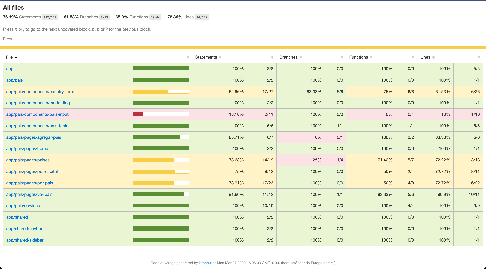

# AngularPaises

- Instalar node_modules con:

```code
npm install
```

- [DEPLOYMENT](https://josegarcia-paises.netlify.app/)
- API - https://restcountries.com/v3.1

## Librerías usadas:

- [Angular](https://angular.io/)
- [Angular Bootstrap](https://angular.io/guide/bootstrap)
- [SweetAlert2](https://sweetalert2.github.io/)
- [Animate.css](https://daneden.github.io/animate.css/)

## Cobertura de testeo inicial



## INFORMACIÓN:

- Tiempo: 3 días.
- Enviar código (enlace GitHub o ZIP).
- Fichero README.txt para saber cómo funciona.
- Valoramos cualquier desarrollo que mejore la funcionalidad (paginado,
  seguridad...).
- Lenguaje de programación deseable: Angular

## PRUEBA TÉCNICA

- Formas parte de un equipo de desarrollo el cual ha de construir un CRUD para la consulta de información referente a países del mundo.
- Construir las pantallas web necesarias para, listar, crear, actualizar, y ver detalles de los países.
- Nota para candidatos Web: podéis apoyaros de la API pública https://restcountries.com/v3.1/all
- Para el listado, y las columnas/datos a mostrar serian:

1. Nombre País
2. Población
3. Idioma Oficial
4. Imagen a su bandera asociada (Al pulsar sobre ella mostrara un modal mostrando su escudo de armas asociado)
5. Icono de su posicionamiento en Google Maps (abrir en pestaña)

- La creación y actualización no tiene que ser funcional.
- Documentación de la API pública: https://restcountries.com/#api-endpoints-v3-all
